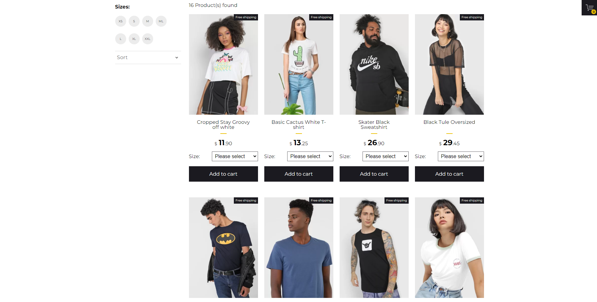

## 🛍️ Простое ecommerce приложение

<p align="center">
  
</p>

### Обзор

* Описание
* Функционал
* Используемые технологии
* [Ссылка на проект]() 
* Запуск проекта

# Описание:

* Простой прототип приложения с корзиной покупок

# Функционал:

В данной работе представлены:
* Адаптивный дизайн
* Добавление и удаление товара из корзины с помощью props и emit
* Фильтрация товаров по размеру
* Сортировка товаров по цене
* Сохранение корзины после перезагруки страницы с помощью localStorage

# Используемые технологии:

* Vue
* axios
* localStorage

# Запуск проекта
```javascript

/* Установка всех зависимостей */
npm install

/* Запуск фейкового апи */
npm run json-server

/* Запустить в новом терминале */
/* Запуск vue приложения */
npm run dev

```
